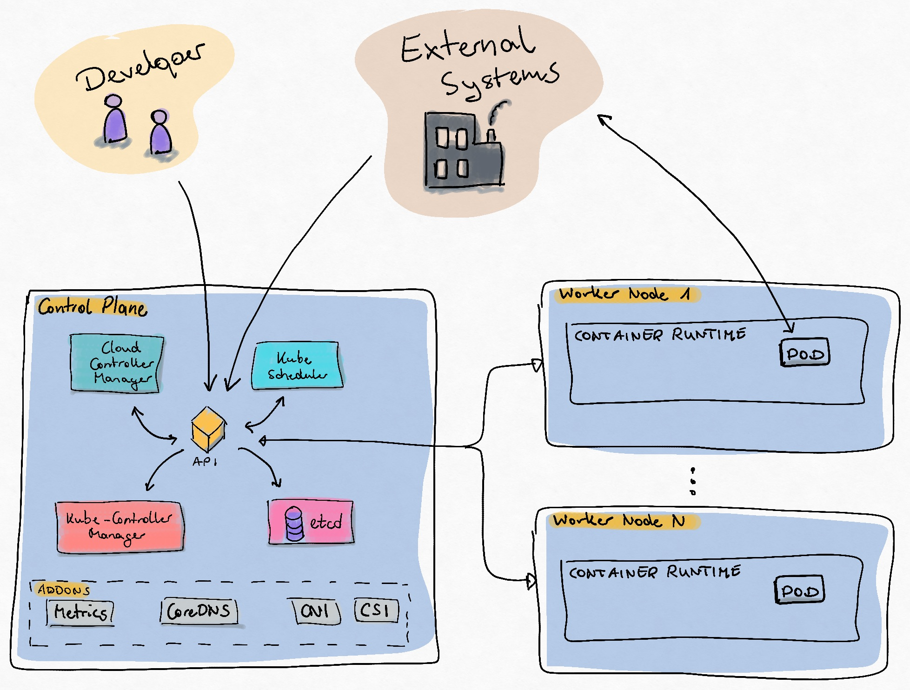
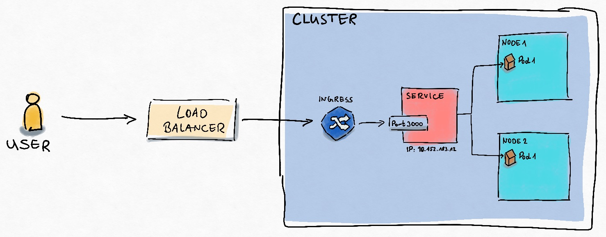
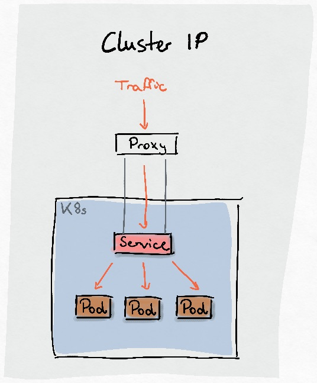
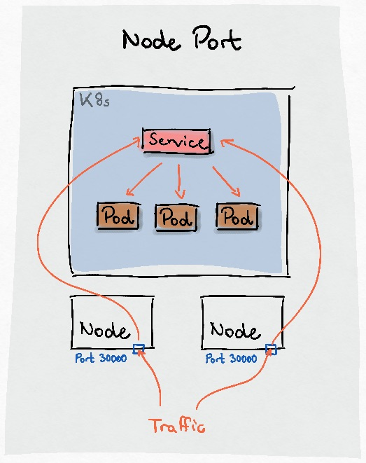
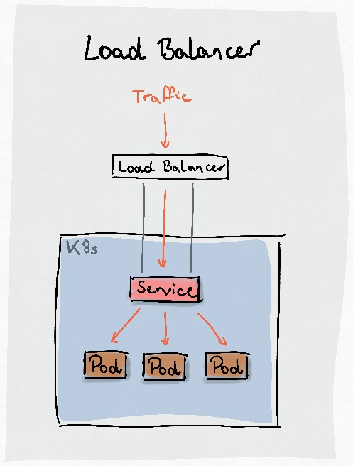

# Kubernetes Cluster Basics

## Overview

A Kuberntes cluster is a set of nodes that run containerized applications. The cluster consists of a control plane and one or more worker nodes. The control plane manages the cluster, while the worker nodes run the applications.

## Networking

Kubernetes networking is a complex topic that involves multiple layers and components. The main components of Kubernetes networking include:
- **Pod Network**: Each pod in a Kubernetes cluster gets its own IP address, and all containers in a pod share the same network namespace.
- **Service Network**: Services provide a stable IP address and DNS name for accessing pods. Services can be of different types, such as ClusterIP, NodePort, LoadBalancer, and ExternalName.
- **Ingress**: Ingress resources manage external access to services, typically HTTP/S traffic. Ingress controllers are responsible for fulfilling the Ingress rules.
- **Network Policies**: Network policies are used to control the traffic flow between pods. They define rules for ingress and egress traffic based on labels and selectors.
- **CNI (Container Network Interface)**: CNI plugins are responsible for providing the networking capabilities for pods. They handle IP address allocation, routing, and network policies.
- **DNS**: Kubernetes has a built-in DNS service that provides name resolution for services and pods. It allows you to use service names instead of IP addresses to access services.
- **Load Balancing**: Kubernetes provides built-in load balancing for services, distributing traffic across multiple pods. This can be done at the service level or using external load balancers.
- **Network Plugins**: Kubernetes supports various network plugins (CNI plugins) that implement the networking model. Some popular CNI plugins include Calico, Flannel, Weave Net, and Cilium.

## Key Concepts
- **ClusterIP**: The default service type, which exposes the service on a cluster-internal IP. It is only accessible from within the cluster.

- **NodePort**: Exposes the service on each node's IP at a static port. It allows external traffic to access the service using `<NodeIP>:<NodePort>`.

- **LoadBalancer**: Exposes the service externally using a cloud provider's load balancer. It is typically used in cloud environments.

